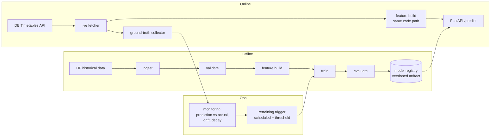
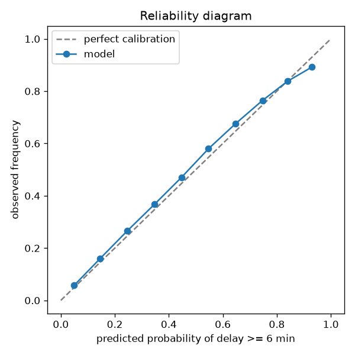

# Deutsche Bahn Train Delay Prediction — End-to-End MLOps

[](https://github.com/alemdarkerem/dbahn-delay-mlops/actions/workflows/ci.yml)
[](https://www.python.org/downloads/)
[](LICENSE)

Predicting Deutsche Bahn train delays at the station-stop level — as a **production ML system**,
not a notebook: a versioned model served via API, fed by an automated data pipeline, monitored
against reality, and retrained automatically.

> **The system is the product.** A small demo UI arrives only at the very end (Phase 6) as a thin
> layer over the API. Everything before that is pipeline, serving, monitoring, and retraining.

## The problem

For a given train stop (station × train × scheduled time), predict:

1. **Classification** — probability the stop is delayed ≥ 6 minutes (DB's own punctuality threshold).
2. **Regression** — expected delay in minutes with uncertainty (p50 / p90 quantiles, not a single
   point estimate).

## Architecture



Key principles:

- **One shared feature pipeline** for training and serving — no train/serve skew.
- **Time-aware validation only** — walk-forward / expanding-window CV, never random splits.
- **Honest baselines first** — results are reported as lift over a per-station/category median
  baseline, not raw metrics.
- **Reproducible** — locked dependencies (uv), seeded runs, single config source.

## Roadmap

| Phase | Scope | Status |
|-------|-------|--------|
| 0 | Skeleton: uv, ruff, mypy, pytest, pre-commit, CI | ✅ |
| 1 | Data foundation: ingest + validation, EDA, data quality findings | ✅ |
| 2 | Baseline + first model: features, time-aware CV, MLflow, calibration | ✅ |
| 3 | Serving: FastAPI, Docker, deploy | ✅ |
| 4 | Live loop: DB API fetcher, ground truth, monitoring | ✅ |
| 5 | Automated retraining, champion/challenger, README polish | 🔜 |
| 6 | Thin demo frontend | 🔜 |

## Quickstart

```bash
git clone https://github.com/alemdarkerem/dbahn-delay-mlops.git
cd dbahn-delay-mlops
make setup   # uv sync + pre-commit hooks (requires uv: https://docs.astral.sh/uv/)
make check   # lint + typecheck + tests — exactly what CI runs
```

## Data pipeline

```bash
make data      # download 24 monthly parquet files from Hugging Face (~6.5 GB)
make validate  # data quality checks on every raw file (tolerant raw profile)
make ingest    # build data/processed/stops.parquet (44.7M rows, ~1.9 GB)
```

The ingest step produces one canonical dataset: timezone-aware (Europe/Berlin, explicit
DST policy), deduplicated by stop id, restricted to a consistent 105-station panel, with
physically impossible rows removed. The processed file must pass a **zero-tolerance**
validation profile; raw files get small calibrated tolerances (see findings below).

## Data quality findings

From full-dataset EDA over 148.4M rows ([notebook](notebooks/01_eda.ipynb)):

1. **Coverage regime change 2025-11.** Coverage jumps from 107 to ~5,300 stations
   (~2M → ~15M rows/month). Training on everything would fabricate a drift signal, so
   ingest restricts to the panel of stations present in *every* month (105 stations).
2. **Heavy-tailed target with ±24 h sentinels.** Median delay is 1 min, p99 = 37 min,
   extremes reach ±24 h. Values at exactly ±1440 min are day-shift artifacts
   (~0.003% of rows) and are dropped. Real multi-hour delays are **kept** — the heavy
   tail is signal, not noise, and is why the model predicts quantiles (p50/p90), not
   a single average.
3. **The classification base rate itself drifts.** P(delay ≥ 6 min) swings between 14%
   and 22.7% per month (peak 2025-10). Random train/test splits would leak seasonal
   regimes — validation must be time-aware, and monitoring must track the base rate.
4. **Delay is meaningless for canceled stops.** 69% of 6.5M canceled stops report
   delay = 0. Canceled rows stay in the dataset (flagged) but are excluded from
   regression targets.
5. **Nulls are structural at route endpoints.** `arrival_*`/`departure_*` are ~10.7%
   null — a route's first stop has no arrival, its last no departure (verified per
   ride). The genuine defect is null `station_name` (up to 2.35% in early-era months),
   dropped at ingest. Bonus: zero duplicate ids across 148M rows, and the dataset
   card's schema is outdated (files carry `train_number`/`line_number`, not
   `train_name`) — the files are the truth, not the docs.

## API

**Live at [db-delay-api.keremalemdar.de](https://db-delay-api.keremalemdar.de/docs)** —
deployed on a Hetzner VPS via Coolify (Docker, HTTPS, healthchecked). Interactive
docs at [`/docs`](https://db-delay-api.keremalemdar.de/docs).

```bash
make serve   # local; or: docker compose up --build
```

```bash
curl -X POST https://db-delay-api.keremalemdar.de/predict \
  -H "Content-Type: application/json" \
  -d '{
    "station_name": "Berlin Hbf",
    "train_type": "ICE",
    "train_number": "1601",
    "scheduled_time": "2026-07-24T17:30:00"
  }'
```

```json
{
  "delay_probability": 0.5638,
  "delay_p50_min": 8.1,
  "delay_p90_min": 35.0,
  "coverage": "train",
  "model_version": "20260723-141746"
}
```

Response semantics: `delay_probability` = P(delay ≥ 6 min); `delay_p50_min`/`delay_p90_min`
= "half of the time at most X" / "9 times out of 10 at most Y"; `coverage` reports how
specific the features were — `train` (this train's own history) → `station_type` →
`type` → `cold` (graceful cold-start fallback instead of failing on unknown inputs).

`GET /health` reports model version and feature-snapshot age; `GET /model-info` returns
the full training metadata. Rolling-history features come from a small **feature
snapshot** exported with the bundle (the serving feature store — same asof semantics as
training, so no train/serve skew). Golden-prediction tests pin exact API outputs against
a committed fixture bundle, so silent feature drift fails CI loudly.

## Live loop & monitoring

Every hour (Coolify scheduled task on the VPS) the system:

1. **Fetches** upcoming planned stops for all 105 panel stations from the DB Timetables
   API (rate-limit-paced, station failures degrade gracefully).
2. **Predicts & seals**: each stop gets a prediction from the deployed bundle, logged
   with a timestamp *before the event*. First prediction wins — re-predicting closer
   to departure would flatter the accuracy reports (hindsight leakage).
3. **Collects ground truth**: observed delay/cancellation changes are recorded on every
   cycle (the API only retains the current day — wait and the truth evaporates).

Every morning the previous day is scored: predictions vs actuals → AUC, Brier, MAE,
p90 coverage, base-rate and coverage-mix drift counters → appended to a daily metrics
series and a human-readable report. `GET /monitoring` exposes the last 30 days:

```bash
curl https://db-delay-api.keremalemdar.de/monitoring
```

Documented assumption: a stop never seen in the change feed counts as on time (same
convention as the dataset's collector). Canceled stops are excluded from delay metrics.

## Data & licensing

- **Historical data:** [`piebro/deutsche-bahn-data`](https://huggingface.co/datasets/piebro/deutsche-bahn-data)
  on Hugging Face — data by **Deutsche Bahn**, licensed **CC BY 4.0**. Raw data is never committed
  to this repo; it is downloaded into the gitignored `data/` directory.
- **Live data:** [DB Timetables API](https://developers.deutschebahn.com) via the DB API Marketplace
  free tier. Credentials live in `.env` (see `.env.example`), never in git.
- **Code:** MIT licensed (see [LICENSE](LICENSE)).

## Results

Walk-forward CV: 6 folds, each trained on a rolling 12-month window (~21.5M stops) and
validated on the following unseen month (2026-01 … 2026-06, ~1.7M stops each). The
baseline is the honest one to beat: historical delayed-rate / delay quantiles per
station × train type. All numbers are means over the 6 folds.

**Classification — P(delay ≥ 6 min)** (base rate 19.2%):

| Metric | Baseline | LightGBM | Lift |
|---|---|---|---|
| ROC-AUC | 0.720 | **0.796** | +0.076 |
| PR-AUC | 0.377 | **0.504** | +34% rel. |
| Brier score ↓ | 0.140 | **0.124** | −11% |
| Calibration error (ECE) ↓ | 0.015 | **0.011** | — |

The model beats the baseline on every one of the 6 folds (per-fold ROC-AUC
0.787–0.803 vs 0.716–0.728). ECE ≈ 0.011 means predicted probabilities deviate from
observed frequencies by ~1pp on average:



**Quantile regression — delay in minutes:**

| Metric | Baseline | LightGBM | Lift |
|---|---|---|---|
| Pinball loss p50 ↓ | 1.938 | **1.807** | −6.7% |
| Pinball loss p90 ↓ | 1.800 | **1.604** | −10.9% |
| MAE of p50 ↓ | 3.88 min | **3.61 min** | −7% |
| p90 empirical coverage (target 0.90) | 0.906 | 0.887 | — |

Honest read: classification gains are substantial; quantile gains are real but more
modest — per-entity historical quantiles are already a strong predictor of a heavy-tailed
target. Model p90 coverage (0.887, per-fold 0.866–0.901) runs slightly optimistic,
worst in storm-heavy January; recalibrating quantile outputs is on the roadmap.

## Monitoring

_Coming with Phase 4 — daily prediction-vs-actual reports, drift indicators._

## Limitations

_Documented honestly as the system evolves._
