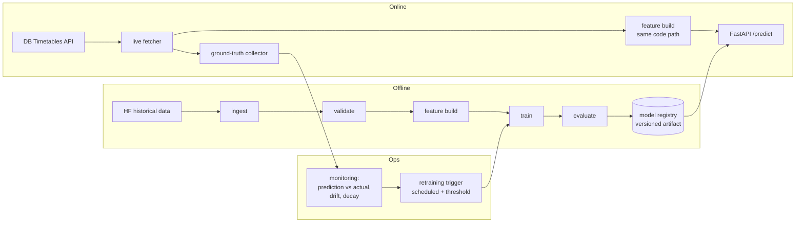

# Deutsche Bahn Train Delay Prediction — End-to-End MLOps

[](https://github.com/alemdarkerem/dbahn-delay-mlops/actions/workflows/ci.yml)
[](https://www.python.org/downloads/)
[](LICENSE)

Predicting Deutsche Bahn train delays at the station-stop level — as a **production ML system**,
not a notebook: a versioned model served via API, fed by an automated data pipeline, monitored
against reality, and retrained automatically.

> **The system is the product.** A small demo UI arrives only at the very end (Phase 6) as a thin
> layer over the API. Everything before that is pipeline, serving, monitoring, and retraining.

## The problem

For a given train stop (station × train × scheduled time), predict:

1. **Classification** — probability the stop is delayed ≥ 6 minutes (DB's own punctuality threshold).
2. **Regression** — expected delay in minutes with uncertainty (p50 / p90 quantiles, not a single
   point estimate).

## Architecture



Key principles:

- **One shared feature pipeline** for training and serving — no train/serve skew.
- **Time-aware validation only** — walk-forward / expanding-window CV, never random splits.
- **Honest baselines first** — results are reported as lift over a per-station/category median
  baseline, not raw metrics.
- **Reproducible** — locked dependencies (uv), seeded runs, single config source.

## Roadmap

| Phase | Scope | Status |
|-------|-------|--------|
| 0 | Skeleton: uv, ruff, mypy, pytest, pre-commit, CI | ✅ |
| 1 | Data foundation: ingest + validation, EDA, data quality findings | ⏳ |
| 2 | Baseline + first model: features, time-aware CV, MLflow, calibration | 🔜 |
| 3 | Serving: FastAPI, Docker, deploy | 🔜 |
| 4 | Live loop: DB API fetcher, ground truth, monitoring | 🔜 |
| 5 | Automated retraining, champion/challenger, README polish | 🔜 |
| 6 | Thin demo frontend | 🔜 |

## Quickstart

```bash
git clone https://github.com/alemdarkerem/dbahn-delay-mlops.git
cd dbahn-delay-mlops
make setup   # uv sync + pre-commit hooks (requires uv: https://docs.astral.sh/uv/)
make check   # lint + typecheck + tests — exactly what CI runs
```

## Data & licensing

- **Historical data:** [`piebro/deutsche-bahn-data`](https://huggingface.co/datasets/piebro/deutsche-bahn-data)
  on Hugging Face — data by **Deutsche Bahn**, licensed **CC BY 4.0**. Raw data is never committed
  to this repo; it is downloaded into the gitignored `data/` directory.
- **Live data:** [DB Timetables API](https://developers.deutschebahn.com) via the DB API Marketplace
  free tier. Credentials live in `.env` (see `.env.example`), never in git.
- **Code:** MIT licensed (see [LICENSE](LICENSE)).

## Results

_Coming with Phase 2 — model performance vs. baseline, calibration analysis._

## Monitoring

_Coming with Phase 4 — daily prediction-vs-actual reports, drift indicators._

## Limitations

_Documented honestly as the system evolves._
